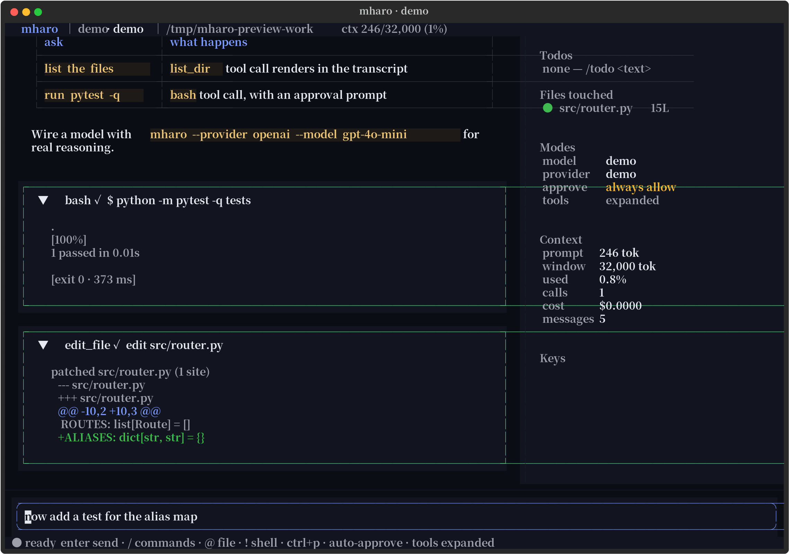

# Mharo — agent core (`ma`) + terminal UI (`mharo`)

A professional terminal UI for AI coding agents — the layout and feel of
`opencode` / `Claude Code` / `Codex`, built on [Textual](https://textual.textualize.io)
so it runs anywhere Python does: terminals, tmux, SSH, and CI (headless).



```
 ✳ mharo │ demo · gpt-4o-mini │ ⎇ main ✱2 │ ~/repo            ctx 12.4k/200k (6%)
┌──────────────────────────────────────────────────────────────────────────────┐
│ ❯ why is the router test flaky?                                    (accent) │
│ ◆ mharo · gpt-4o-mini   ✓ 1.8s                                             │
│   Because `ROUTES` is module-level…                                        │
│   ▾ read_file ✓  read src/router.py                                        │
│   ▾ bash ✓  $ pytest -q tests/test_router.py    [exit 0 · 412 ms]          │
│   ▾ edit_file ✓  edit src/router.py            +diff, coloured             │
│                                        │ Todos         │ Files touched    │
│                                        │ ☑ add assert │ router.py  12L   │
├──────────────────────────────────────────────────────────────────────────────┤
│  now add a test for the alias map                                          │
│ ● ready  enter send · / commands · @ file · ! shell · ctrl+p  auto-approve  │
└──────────────────────────────────────────────────────────────────────────────┘
```

Two surfaces, one engine:

| command | what it is |
| --- | --- |
| `ma "fix the flaky test"` | the Phase 1 core agent: plan → act with tools → verify with proof → cost ledger |
| `mharo` | the professional terminal UI (opencode / Claude Code style) for the same tools and providers |

The UI and the CLI share `mharo_tui.agent.tools` (the tool registry) and
`mharo_tui.agent.providers` (the streaming transports), so one `pip install -e .`
gives you both and a tool you register is usable from either side.

## Install

```bash
pip install -e .              # from this directory → installs BOTH `mharo` (TUI) and `ma` (agent)
# or, minimal:
pip install textual rich httpx
python -m mharo_tui           # the TUI
python -m mharo doctor        # the agent's self-check, same source tree
```

Requires Python ≥ 3.10. No API key needed to run it — the built-in
`demo` provider drives the real tool pipeline offline so every panel, fold and
approval prompt is exercisable.

## Run

```bash
mharo                                  # TUI, provider sniffed from the env
mharo -p openai -m gpt-4o-mini         # OpenAI
mharo -p openai --base-url http://localhost:11434/v1 -m qwen2.5-coder:32b   # Ollama
mharo -p anthropic -m claude-sonnet-4-5
mharo "explain @src/server.py"         # one-shot, prints markdown and exits
mharo --print "run the tests"          # headless (no TTY required)
mharo --plain                          # rich REPL (same agent core)
mharo -c                               # resume the latest session
mharo -y                               # auto-approve edits & commands
```

Environment: `MHARO_PROVIDER`, `MHARO_MODEL`, `MHARO_BASE_URL`,
`MHARO_API_KEY` / `OPENAI_API_KEY` / `ANTHROPIC_API_KEY`, `MHARO_HOME`
(session storage, default `~/.mharo`), `MHARO_ALLOW_OUTSIDE_CWD=1`.

## What you get

**Transcript**
- one visual language per block: `❯` user (accent stripe), `◆ mharo · model  ✓ 1.8s`
  assistant, `▸/▾` foldable tool calls, `✕` provider errors, `notice` for command output
- streamed markdown (throttled repaints — a flush every ~55 ms, not per token)
- tool blocks show the one-line preview while folded, output + coloured unified diff
  when open; short results auto-expand

**Prompt**
- multi-line `TextArea` that grows as you type (Enter sends, Shift+Enter newline)
- `/` slash-command completion, `@file` mentions inlined as fenced context,
  `!cmd` runs the shell straight through the tool layer (no model round-trip)
- `ctrl+p` fuzzy palette over commands *and* actions

**Agent loop**
- provider → tool call → approval → result → continue, up to `--max-turns`
- inline approval modal showing the exact command or the diff, with
  `y` allow / `a` always allow this tool / `n` deny; `ctrl+f` arms auto-approve
- `esc` interrupts mid-stream, `ctrl+r` re-runs the last prompt,
  `/compact` summarises older turns to buy context back
- sessions persist as JSONL (`~/.mharo/sessions`), `/resume <id>` replays them
  into blocks exactly as they rendered

**Sidebar** (`ctrl+b`): todos, files touched, modes, live token budget and cost, keymap.

## Tools available to the model

| tool | gate | notes |
|---|---|---|
| `bash` | approval | cwd = project, timeout, output truncated head+tail, refuses `rm -rf /`, `mkfs`, raw device writes |
| `read_file` | auto | 1-based line numbers, `offset`/`limit` paging, refuses >3 MB |
| `list_dir` | auto | compact tree, skips vendored dirs |
| `search` | auto | regex or literal, `path:line:` output |
| `write_file` | approval | always renders a unified diff |
| `edit_file` | approval | exact-match find/replace, refuses ambiguous matches |

Add your own without touching the UI:

```python
from mharo_tui.agent import AgentConfig
from mharo_tui.agent.tools import ToolSpec, ToolContext

def commit(ctx: ToolContext, message: str = "", **_) -> str:
    if not message:
        raise ValueError("commit: message required")
    return subprocess_result(ctx, f"git commit -m {message!r}")

cfg = AgentConfig(cwd=".")
cfg.extra_tools["commit"] = ToolSpec(
    "commit", "Commit staged changes", "", "Commit with a message.",
    {"message": {"type": "string"}}, commit, approval=True, read_only=False,
)
```

## The `ma` agent — Phase 1

Rule #1 of the project: **no stubs**. Everything below is executed for real —
`ma doctor` probes the environment, `ma bench` runs the engine against a temp
project, and both are part of CI. `ma bench` uses a *scripted transport*, not
mocked logic: the router, tools, SQLite, permission engine, verification gate and
fix rounds all run their production code paths.

### Quickstart

```bash
pip install -e .
export OPENAI_API_KEY=***            # or ANTHROPIC_API_KEY, or a local server
ma "make the tests pass"             # plan → act → verify → print the proof
ma doctor                            # 19 probes: python, deps, db, keys, tools, router, memory…
ma bench                             # 10 engine scenarios, offline, ~3 s
ma cost                              # spend per model / session, straight from the ledger
```

No key yet? Drive the real loop offline with a replay script:

```bash
ma --provider replay --replay-file script.json --yes "inspect the repo and run the suite"
```

`script.json` is a list of turns; a turn may contain `text`, `calls`
(`[{"tool": "bash", "args": {"command": "pytest -q"}}]`), `usage`, or `error`:

```json
[{"text": "Reading the layout."},
 {"calls": [{"tool": "list_dir", "args": {"path": "."}}]},
 {"text": "61 tests pass; the repo has two packages."}]
```

A real run of exactly that shape:

```
  route · cheap ← router: routine words: run
  plan · 1. inspect the repo and run the test suite
  … tree .
  ✓ list_dir ok (0.0s)
  … $ python3 -m pytest -q
  ✓ bash ok (16.0s)
Suite is green: 61 passed. …

✓ inspect the repo and run the test suite
  1. [x] inspect the repo and run the test suite (2 tool calls)
  proof:
    pytest 61✓ exit=0 16.1s
    claim: accepted — proof found
  cost: $0.0021 · 1.2k in / 310 out · 3 turns · 32.4s
```

### Free pe chalao, key baad me — run free first, ask for a key later

`ma` never blocks on a missing API key. It walks a **ladder** of zero-cost rungs —
each probed, each with its own rate gate — and only tells you to add a key when they
are actually spent. Same ladder in the TUI (`/provider auto`, `/free`).

| rung | what it costs | its limit | why it is placed there |
| --- | --- | --- | --- |
| `ollama` `lmstudio` `llamacpp` `vllm` | nothing | none | local, private; auto-detected on `127.0.0.1`, model list read live from the server |
| `ovh` | nothing, **no key, no signup** | ~2 req/min **per model** per IP | 6 chat models (`gpt-oss-120b`, `Qwen3-Coder-30B`, Llama-3.3-70B…); rotating models beats sleeping |
| `pollinations` | nothing, no key | polite 2 s gate | no tool calling; its upstream credits dry up, so it sits last among anonymous |
| `openrouter` `llm7` `gemini` `groq` | $0/token `:free` models | e.g. 20 req/min · 50 req/day | needs a *free* key: `ma keys add openrouter sk-or-…` |
| your `openai` / `anthropic` keys | paid | your quota | lead when configured — and they also *rescue* a throttled run onto a free rung |

```bash
ma free                       # the ladder as it stands (local ports checked, remote from cache)
ma free --probe               # actually ask each endpoint: GET /models
ma free --probe --completions # …plus one tiny real completion per rung (spends quota, slow)
ma free --test "your prompt"  # one real answer from the best rung, with token + cost line
ma free --pick ovh            # write free.prefer + tiers.cheap.provider = "auto"
ma keys                       # who has keys → "none yet — and none needed"
ma keys add openai sk-…       # the escape hatch; stored 0600, never echoed back
```

What the ladder does under a free tier, because free tiers are the hard part:

- **Per-pairing gates.** `ovh:gpt-oss-120b` and `ovh:gpt-oss-20b` keep separate clocks.
  A used pairing cools for `free.min_interval_s` (31 s on OVH) while its sibling
  answers immediately — that is how a 2 req/min limit still carries an agent run.
- **Wait, don't hammer.** If every pairing is gated and the soonest frees within
  `free.patience_s` (20 s), the call sleeps that gap instead of burning a 429.
- **Storm detection.** Three 429s on one host inside a minute retires the whole host
  briefly and hands the turn to another one.
- **A rejected body is re-bodied, not punished.** If a host refuses `stream_options`,
  or refuses streaming once tools are attached, that *host* is downgraded one step at a
  time (`full → no_stream_options → no_tools → minimal`) and the leaner body is retried
  at once — no backoff, because the rung did nothing wrong. The learned shape is cached in
  `~/.mharo/ladder.json` per host, so turn two doesn't relearn it. (`tools` must be nested
  under `"function"`; a flat spec gets a 422 from strict OpenAI-compatible servers, which
  otherwise reads as "this free tier can't do tool calls" — it can.)
- **Dead ports are parked, not dialed.** A local rung that isn't listening is marked offline
  for the session (20 s) instead of costing every turn its connect timeout.
- **Quota ≠ throttle.** `402` / `insufficient credits` / `exceeded your current quota`
  backs a host off for 15 minutes and prints `ma keys add …`; a bare
  "API rate limit exceeded" costs one gate window, because that reply proves the
  endpoint is alive.
- **Your key is respected, and rescued.** With a key configured it answers first;
  if it is throttled or out of credit mid-run, the free ladder finishes the turn
  and says so (`free.rescue_on_exhaustion`).
- **Nothing is faked.** If the ladder *and* your keys are dry, `ma` answers from the
  offline demo provider and marks it in the transcript and in `--json` `notices`.

Config, all optional (`~/.mharo/config.json`):

```json
"free": {
  "enabled": true,
  "prefer": ["ollama", "ovh"],
  "disable": ["pollinations"],
  "min_interval_s": {"ovh": 31},
  "patience_s": 20,
  "max_rungs": 4,
  "allow_paid": true,
  "rescue_on_exhaustion": true,
  "fallback_to_demo": true,
  "extra_rungs": [{"name": "vllm-lan", "base_url": "http://10.0.0.5:8000/v1",
                   "models": ["qwen3-coder-30b"], "tools": true}]
}
```

A real run from this repo with **no key configured** — two rungs were rate-limited,
the third answered:

```text
$ ma free --test "Reply in one short sentence: what is a git rebase?"
  asking ovh:gpt-oss-120b … (no key sent)
     ↳ HTTP 429: {"message":"API rate limit exceeded", …} — trying the next rung
  asking ovh:gpt-oss-20b … (no key sent)
     ↳ HTTP 429: {"message":"API rate limit exceeded", …} — trying the next rung
  asking ovh:Meta-Llama-3_3-70B-Instruct … (no key sent)

  A git rebase is a command that replays local commits on top of updated commits
  from a remote repository, rewriting the commit history.

  ✓ ovh:Meta-Llama-3_3-70B-Instruct · 1285 ms · 48 in / 28 out · $0.00
```

`ma doctor` checks the whole arrangement: `free.enabled`, `free.ladder`,
`free.rate-gate` (fails if a gate is *below* the tier's own documented limit —
that turns a free tier into a 429 spiral), `free.keyless`, `free.cooling`.

### Commands

| command | what it does |
| --- | --- |
| `ma "<task>"` | one-shot agent run (`--tier auto\|cheap\|strong`, `--yes`, `--json`, `--max-turns`, `--allow`, `--deny`) |
| `ma repl` | multi-turn session with `/review`, `/debt`, `/gain`, `/undo`, `/mem`, `/skill`, `/sub`, `/keys`, `/doctor` |
| `ma doctor [--strict]` | self-check; `--strict` turns warnings into failures for CI |
| `ma bench [--only name] [--json]` | engine benchmark (10 scenarios, deterministic) |
| `ma cost [--by model\|session\|day]` | cost dashboard from the SQLite ledger |
| `ma sessions [--show ID]` | stored sessions, cost, status, proof |
| `ma undo [ID] [--list]` | roll back the file edits a session recorded |
| `ma memory [--search Q] [--note TEXT]` | semantic recall / store in the memory table |
| `ma skill list\|show\|run\|new` | SKILL.md files as executable, validated tasks |
| `ma vault set\|get\|list\|rm\|exec` | local secret store (0600) + env-scrubbed `exec` |
| `ma free [--probe\|--test PROMPT\|--pick NAME]` | the free-first provider ladder: probe it, run a real prompt on it, pin a preference |
| `ma keys [add\|rm] [service] [key]` | show / store / drop API keys — the step *after* the free rungs run out |
| `ma init [--force]` | write `~/.mharo/config.json` from the resolved defaults |
| `ma tui` | open the terminal UI on the same config |

### How a run works

```
task ─▶ router.pick()            cheap | strong, with reasons
      ─▶ memory.recall()         vector + keyword recall of past work
      ─▶ plan()                  STRICT JSON steps (falls back to one step)
      ─▶ act(step)     ┌─────────────────────────────────────────┐
                       │ provider stream (SSE) → text | tool_call│
                       │ permission decide → allow/ask/deny      │
                       │ snapshot file → run tool → redact → db  │
                       │ router.should_upgrade() mid-step        │
                       └─────────────────────────────────────────┘
      ─▶ verify()                auto-detected checks + claim audit + sanity + peer review
      ─▶ fix rounds              up to N, escalating to the strong tier
      ─▶ result                  answer + proof + cost, persisted in SQLite
```

`Result.ok` is **not** the model's opinion. It is `checks passed ∧ claim proven ∧
no sanity finding ∧ every step done`. A confident "all tests pass, done" with a
failing suite returns `ok=False` — `ma bench claim-audit` asserts exactly that.

### Configuration

`~/.mharo/config.json` (or `--config`, or `MHARO_*` env vars):

```json
{
  "tiers": {
    "cheap":  {"provider": "openai",   "model": "gpt-4o-mini",      "max_output_tokens": 2048},
    "strong": {"provider": "anthropic","model": "claude-sonnet-4-5","max_output_tokens": 8192}
  },
  "providers": {
    "openai":    {"base_url": "https://api.openai.com/v1", "keys_env": ["OPENAI_API_KEYS", "OPENAI_API_KEY"]},
    "anthropic": {"keys_env": ["ANTHROPIC_API_KEY"]},
    "local":     {"base_url": "http://127.0.0.1:11434/v1", "keys_env": [], "model": "qwen2.5-coder:32b"}
  },
  "fallbacks": ["cheap", "strong"],
  "free":      {"enabled": true, "prefer": [], "patience_s": 20, "rescue_on_exhaustion": true},
  "budget":    {"max_session_usd": 2.0, "max_turns": 12, "turn_timeout_s": 300},
  "permissions": {"default": "ask", "allow": ["read_file", "list_dir", "search", "bash:git status*"],
                  "deny": ["bash:sudo*", "bash:rm -rf /*", "write_file:.env*"]},
  "verify":    {"auto_checks": "auto", "peer_review": true, "max_fix_rounds": 2},
  "memory":    {"enabled": true, "dims": 256, "recall_k": 4},
  "cost":      {"prices": {"gpt-4o-mini": [0.15, 0.60]}},
  "proxy":     {"http": null, "https": null},
  "skills_dirs": ["skills", "~/.mharo/skills"],
  "subagents": {"reader":  {"tools": ["read_file", "list_dir", "search"], "tier": "cheap"},
                "tester":  {"tools": ["bash", "read_file"], "tier": "cheap"},
                "patcher": {"tools": ["read_file", "edit_file", "write_file", "search"], "tier": "strong"},
                "reviewer":{"tools": ["read_file", "search", "list_dir"], "tier": "strong"}}
}
```

`ma doctor` prints the *resolved* values, so there is never a question about
which config won. `--base-url http://127.0.0.1:11434/v1 --model qwen2.5-coder:32b`
is all you need for Ollama / LM Studio / vLLM.

### Model routing

`mharo/router.py` scores the request before a token is spent on it: hard signals
(refactor, architecture, "across the repo", security, concurrency), long
multi-file asks and explicit step hints go to `strong`; routine edits, "fix typo",
rename, single-file asks go to `cheap`. Every decision carries reasons —
`ma --json` includes them. Mid-run escalation is real: N consecutive tool
failures, a failed verification, or a diff wider than ~250 lines promotes the fix
round to the stronger tier, while the budget guard demotes it (stays cheap) once
85 % of the session cap is spent. `ma doctor router` proves all four behaviours.

### Verification

1. **checks** — `pytest` / `npm test` / `pnpm` / `yarn` / `bun` / `cargo test` /
   `go test` / `make test` / `just test` are detected from the manifests and run
   as subprocesses with real exit codes and parsed counts; a tool that is not
   installed is *skipped*, never faked.
2. **claim audit** — completion language ("fixed", "done", "all tests pass",
   "green") is only accepted if a passing check backs it, and if no file changed
   after that check (checks are re-run when they do).
3. **diff sanity** — changed Python is byte-compiled, JS gets `node --check`,
   JSON is parsed, empty/oversized files and stub markers are flagged.
4. **peer review** — the strong tier reviews the diff adversarially and returns
   `{file, line, issue, severity}` items that feed the fix round.

### Subagents

`mharo/subagents.py` runs specialist roles as isolated mini-runs: own messages,
own **filtered** tool registry, own tier, bounded parallelism (default 3), and a
structured JSON result. The isolation is enforced, not cosmetic — the `reader`
registry does not contain `bash`/`write_file`, so a `rm -rf /` request from it is
recorded as a violation and refused (`ma bench subagent-isolation`). Subagents
never open an approval prompt: anything that would need approval is denied and
reported to the parent. `ma repl` → `/sub reader "…"` for one call, or
`SubAgentRunner.run_many([...])` in code.

### Skills

A `skills/<name>/SKILL.md` is executable, not decorative:

```markdown
---
name: test-writer
description: Write the failing test first, then the fix, then prove it
tools: read_file, search, bash, edit_file, write_file
tier: strong
max_turns: 6
verify: checks
---
Body: the prompt. {task}, {diff} and {memory} are substituted.
```

`ma skill list` validates every file — unknown tools, bad tiers, non-integer
budgets and empty bodies are reported (`--strict` exits non-zero), so a broken
skill is a failure instead of a silently ignored file. Two skills ship in
`skills/`: `code-review` and `test-writer`.

### Memory

SQLite, no external service, no torch. Documents are embedded as hashed token
vectors (`HashingEmbedder`, unit-norm) with a lexical blend so a single-word query
like `WAL` still finds the WAL note; if you run Ollama or an embeddings
endpoint, set `memory.embed_url` and the same code path swaps in real model
vectors. Recall is written into the prompt as a short block
(`memory.context_block`) before planning, and every finished run is stored as a
`task` memory with its files, cost and proof. Long sessions are compacted:
`compress_messages` folds old turns into one digest, keeps the tail, and the
`/gain` command reports the measured characters that never reached a model.

### Secrets & permissions

- Tool output is redacted *before* it reaches the model or the DB: vault values
  (exact strings) plus patterns for OpenAI/Anthropic/AWS/GitHub/Slack/GitLab/Google
  keys, private-key blocks, bearer headers and `password=` assignments.
- `bash` runs with a scrubbed environment (`PATH`, `HOME`, `LANG`, …) plus only
  the vault entries you name (`ma vault exec --service deploy ./deploy.sh`).
- The vault file is written 0600 via a temp file + `chmod` + atomic rename, and
  `ma doctor` fails if the mode is looser.
- Allow / ask / deny rules are `tool` or `tool:subject-glob`
  (`bash:git status*`, `write_file:*.md`); deny wins, then `always`, then allow,
  then ask, then the default. `ma doctor permissions` runs the matrix.

### Sessions, undo, cost

`~/.mharo/agent.db` (WAL) holds `sessions`, `messages`, `tool_calls` (args,
result, permission decision, duration), `usage` (per call: tier, provider, model,
key label, tokens, cost, latency), `snapshots`, `checks`, `memories`, `events`.
Before any `write_file`/`edit_file` the previous bytes are snapshotted, so
`ma undo [session]` restores exactly what the agent changed — including deleting
files it created. `ma cost` aggregates the same rows the engine wrote; models
without a price entry are listed as unpriced instead of silently counting $0.

### Layout

```
mharo/
  __main__.py     entry
  cli.py          argparse: run/repl/doctor/bench/cost/sessions/undo/memory/skill/vault/init/tui
  engine.py       plan → act → verify → fix rounds → proof (Result)
  providers.py    tier × key-pool × protocol hub, replay transport, usage ledger
  keys.py         multi-key rotation, cooldowns, .env loading
  router.py       cheap/strong scoring + dynamic upgrade + budget guard
  permissions.py  allow/ask/deny policy and decisions
  verify.py       check detection, subprocess runs, claim audit, sanity scan, peer review
  subagents.py    isolated specialist roles
  skills.py       SKILL.md parsing + validation
  memory.py       embeddings, recall, compaction
  sessiondb.py    SQLite schema, sessions, ledger, undo snapshots
  cost.py         dashboard over the ledger
  vault.py        secret store + redaction
  doctor.py       19 self-checks
  bench.py        10 engine scenarios
```

### Tests

```bash
python3 -m pytest -q              # 61 tests: 23 TUI + 38 engine
python3 -m pytest tests/test_ma_core.py tests/test_ma_engine.py -q
python3 -m ruff check mharo mharo_tui tests scripts --select F,E9
ma bench && ma doctor
```

The engine tests use the replay transport against real temp projects — tools
touch real files, `pytest` really runs, the claim gate really rejects an
unsupported "all tests pass". Nothing is mocked at the layer under test.

### Phase 1 — definition of done, with the command that proves each line

| # | requirement | proof you can run |
| - | --- | --- |
| 1 | `ma` runs and a provider answers for real | `ma "…"` with a key, or offline: `ma --provider replay --replay-file s.json "…"` · `ma doctor` (`keys.*`, `net.*`) · `ma bench basic-answer` |
| 2 | multi-key rotation + fallback, really tested | `ma bench key-rotation` (429 → key #1 cooled down, key #2 answers) · `tests/test_ma_core.py::test_keypool_cooldown_and_disable` |
| 3 | smart router upgrades cheap → strong, in a test | `ma doctor router` (routine→cheap, hard→strong, upgrade→strong, budget-guard→cheap) · `test_router_picks_by_signal`, `test_router_step_hint_and_upgrade_rules` |
| 4 | subagent army: 2 subagents, isolated tools | `ma bench subagent-isolation` · `test_subagent_reader_cannot_touch_mutating_tools`, `test_subagent_parallel_roles_and_unknown_role` |
| 5 | self-verification catches the failure (negative proof) | `ma bench claim-audit` + `ma bench fix-round` · `test_verification_rejects_confident_lie`, `test_verification_accepts_real_proof_after_fix` |
| 6 | SQLite session save/resume, `/undo` wired | `ma bench session-undo`, `ma sessions --show ID`, `ma undo ID` · `test_sessiondb_persistence_ledger_and_undo`, `test_undo_restores_agent_edit` |
| 7 | memory recall returns a similar past task (vector) | `ma bench memory-recall` · `test_memory_recall_and_context_block`, `test_memory_compaction_replaces_old_turns` |
| 8 | vault injects creds at the tool boundary, never into the model | `ma vault exec ./deploy.sh`, `test_vault_roundtrip_mode_and_redaction`, `test_secret_never_reaches_the_transcript` |
| 9 | `ma doctor` really runs every check | `ma doctor` → here 40 pass · 6 warn · 0 fail, incl. five `free.*` checks (warnings are optional tools like `rg`/`cargo`) |
| 10 | `ma bench` runs real scenarios | `ma bench` → 10/10 in ~2.5 s |
| 11 | no key at all → a real model answer, via free providers | `ma free --test "…"` · `test_tui_boots_on_the_free_ladder_with_no_key`, `test_hub_with_no_keys_at_all_runs_on_the_ladder` |
| 12 | rate-limit aware: per-model gates, wait-not-hammer, storm detection | `ma doctor` (`free.rate-gate`) · `test_models_on_one_host_rotate_instead_of_hammering`, `test_free_tier_gate_is_waited_out_not_tripped_over`, `test_throttle_storm_retires_the_whole_host` |
| 13 | free spent → the user is told to add a key; a throttled paid key → free rescue | `ma keys` (0 keys → "none needed") · `test_a_configured_key_answers_first_with_a_free_rescue`, `test_auto_provider_gives_up_with_instructions_not_a_stack_trace` |
| 14 | a host that rejects our payload is re-bodied and learns its shape | `ma free` (`state` column → `no_tools · 1 downgraded`) · `test_host_learns_the_payload_shape_it_accepts`, `test_engine_retries_a_leaner_body_instead_of_blaming_the_rung`, `test_tool_schemas_use_the_openai_envelope`, `test_a_dead_local_port_is_not_offered_again` |

```bash
ma bench && ma doctor && python3 -m pytest -q     # 10/10 · healthy · 101 passed
```

## Embedding it in an existing project

The UI never imports a model directly — it talks to `Agent`, and `Agent` talks
to a `Provider`. So for `MharoAgent` you can keep your own backend and swap only
the transport:

```python
from mharo_tui.agent.providers import Provider
from mharo_tui.app import MharoApp
from mharo_tui.agent import AgentConfig

class MyAgentProvider(Provider):
    name = "mharo"
    async def stream(self, messages, tools=None):
        async for chunk in your_existing_client(messages, tools):   # your code
            yield {"type": "text", "text": chunk}                    # our event shape
        yield {"type": "done", "stop_reason": "end_turn"}

cfg = AgentConfig(cwd=".")
app = MharoApp(cfg)
app.agent.provider = MyAgentProvider(cfg.model or "mharo")
app.run()
```

Event contract: `text`, `thinking`, `tool_call{name,args,call_id}`,
`usage{input_tokens,output_tokens}`, `done{stop_reason}`, `error{text}`.
That is the *only* interface a backend must implement.

## Tests

```bash
pip install pytest pytest-asyncio
pytest -q            # 101 tests: core 20 · engine 18 · ladder 33 · TUI 30 (headless, Textual Pilot)
python scripts/preview.py --png   # regenerates preview.svg/png
```

The suite boots the real app (no mocks) and asserts: typing + Enter sends,
streaming renders markdown, a tool call folds and reports `✓`, the approval
modal actually blocks the tool until answered, `esc` interrupts, every key
binding toggles the right chrome, `@file` inlining works, and sessions
round-trip through JSONL. `test_render_snapshot_for_readme` fails if the UI
throws while painting — it's a render test as much as a screenshot generator.

## Layout

```
mharo_tui/
  app.py           MharoApp: composition, keymap, event routing (~870 lines)
  widgets.py       TopBar, User/Assistant/Error/Notice blocks, ToolView,
                   ApprovalPrompt, PromptInput, Palette, CompletionPopup, Sidebar, StatusLine
  app.tcss         layout + skin (only standard Textual variables)
  commands.py      slash-command registry
  themes.py        4 themes (night / ink / slate / day)
  plain.py         headless & no-TTY fallback sharing the same Agent
  agent/
    __init__.py    the turn loop, approvals, cancellation, /compact
    providers.py   demo · OpenAI-compatible · Anthropic (SSE streaming)
    tools.py       tool registry, safety guards, diffing, git status
    session.py     message model, token + cost accounting, JSONL persistence
```

## Notes on behaviour worth knowing

- `$` colours are resolved in Python (`widgets.pal`) because Textual substitutes
  CSS variables in stylesheets only — rich style strings get no substitution.
- `TextArea` on Textual ≥ 8 has no `content`/`line_count` attributes; the prompt
  reads `.text` and sizes itself from `splitlines() + 2` (the border costs two
  rows — get that wrong and the text renders into a zero-height viewport).
- `Horizontal` defaults to `height: 1fr`; every widget inside a foldable block
  is pinned to `height: auto` or the block swallows the transcript.
- The Enter key on `TextArea` inserts a newline by default; the prompt overrides
  it with a priority `Binding`, which keeps cursor movement, selection and
  undo working.

MIT licensed.
